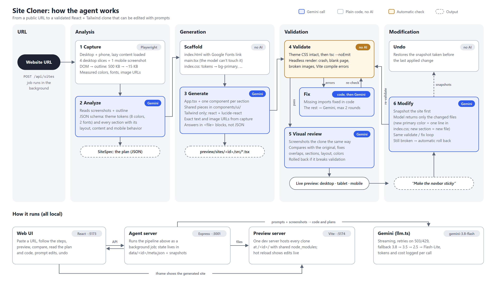

# Site Cloner

An AI agent that takes a public website URL and rebuilds its frontend as a new React + TypeScript +
Tailwind app. It analyzes the page, writes the components, checks that they compile and render,
shows a live preview (desktop, tablet, mobile), and edits the result from plain-English prompts such as
"make the navbar sticky".

The output is new code, not an embedded copy: every section of the original becomes its own React
component, styled with Tailwind and driven by a shared theme.

## Setup

Requirements: Node.js 20+ and a Gemini API key ([get one here](https://aistudio.google.com/apikey)).

```bash
npm run setup              # installs the three packages and Playwright's Chromium
cp .env.example .env       # then put your key in GEMINI_API_KEY
npm run dev                # starts everything
```

Open **http://localhost:5173**, paste a URL and press **Clone site**.

A free-tier key works, but Google allows only about 20 requests per model per day on it, and free-tier
calls are the first to get "model overloaded" errors. A clone uses 3–5 requests and an edit 1–2, so
for a demo a key with billing enabled is much smoother (and costs cents).

`npm run dev` starts three processes:

| Port | Process | Role |
|------|---------|------|
| 5173 | `web/` | The UI you use |
| 3001 | `server/` | The agent and its HTTP API |
| 5174 | `preview/` | One Vite server that hosts every generated site at `/<site-id>/` |

If `npm run dev` stops with "ports are already in use", an earlier copy is still running; the message
prints a one-line command to stop it. If the UI shows "Can't reach the agent server", restart
`npm run dev`.

Generated code is written to `preview/sites/<site-id>/src/`. Agent state (screenshots, analysis, logs,
token usage, undo snapshots) is in `data/<site-id>/`.

## Architecture



(Vector version: [docs/architecture.svg](docs/architecture.svg).)

**1. Capture** (`capture.ts`, `extract-dom.js`, no AI). Headless Chromium opens the page twice, at
desktop size and at phone size. It scrolls through to trigger lazy loading and takes screenshots.
Then a script inside the page walks the rendered DOM and writes a compact, indented outline. The
outline keeps headings, text, links, buttons and images; column counts; background colors and
gradients; font sizes; and sticky or fixed positioning. It skips scripts, hidden elements and wrapper
divs that add nothing. A page with 500 KB of HTML becomes about 10–25 KB of outline. The script also
measures the most used colors (weighted by area) and fonts, and lists every image URL.

**2. Analyze** (`analyze.ts`). Gemini receives the screenshots and the outline and returns a JSON plan
that matches a schema: design tokens (8 colors, heading and body font, style notes) and the sections
from top to bottom. For each section it gives the component name, layout, the real content, and how it
should adapt on mobile. The UI shows this plan in the **Analysis** tab.

**Scaffold** (`scaffold.ts`, no AI). Writes the fixed parts of the site: `index.html` with the Google
Fonts link, `main.tsx`, and `index.css`, which turns the tokens into Tailwind theme variables
(`bg-primary`, `font-heading`, ...).

**3. Generate** (`generate.ts`). Gemini writes `App.tsx` and one component per planned section, plus
shared UI pieces in `components/ui/`. It gets the screenshots (for appearance), the outline (for exact
text and image URLs) and the plan (for structure).

**4. Validate and fix** (`validate.ts`, `autofix.ts`). Static checks come first. `tsc --noEmit`
catches missing imports, wrong props and syntax errors, with exact file and line, and a separate check
confirms the theme block in `index.css` is intact. Then headless Chrome loads the site through the
preview server and catches crashes during render, modules Vite cannot compile, images that fail to
load, and a blank page. The most common errors (a used icon or component that was never imported, a
lucide icon that doesn't exist) are fixed **in code, without a model call**. What remains goes back to
Gemini with the affected files. This repeats at most twice.

**5. Visual review** (`review.ts`). Working code can still look wrong, for example with overlapping
elements or a missing section. The agent screenshots its own clone exactly the way it captured the
original, shows Gemini each original/clone pair, and applies the fixes it returns. The site is
snapshotted first; if the reviewed version doesn't pass validation, it is rolled back.

**6. Modify** (`pipeline.ts`). The current source files and the instruction go to Gemini, which
returns only the files it changed (or deletes). Before writing, the agent snapshots the site. After
writing, it runs the same validate/fix loop. If the site is still broken, the agent rolls back to the
snapshot, so a bad edit never leaves a broken site. **Undo** restores the previous snapshot.

## Technologies and models

- **Agent server:** Node.js, TypeScript, Express, Playwright (Chromium)
- **LLM:** Google Gemini `gemini-3.8-flash` via `@google/genai`, with vision input. Configurable with
  `GEMINI_MODEL`.
- **Generated sites:** React 19, TypeScript, Tailwind CSS v4, lucide-react icons, served by Vite
- **Validation:** TypeScript 7 compiler (`tsc --noEmit`), Playwright
- **UI:** React 19 + Vite, plain CSS

## Key implementation decisions

- **Facts from the browser, judgment from the model.** Text, hex colors, fonts and image URLs are
  measured in the browser and given to the model, so it copies them instead of guessing. The model
  decides what only it can: how to group elements into sections and how to lay them out.
- **Screenshots and DOM together.** A screenshot shows the layout but makes the model read text from
  pixels. The DOM has exact text but says little about how the page looks. Using both beats either
  alone.
- **A plan before code.** Analysis returns schema-validated JSON first, so generation starts from a
  fixed list of components rather than improvising the structure. The plan is also shown to the user.
- **Deterministic wherever possible.** `index.html`, `main.tsx`, the Tailwind setup and the theme CSS
  are written by code, not by the model, so they cannot break. The model only writes components.
- **Theme tokens.** Brand colors and fonts are Tailwind theme variables, so a global change like
  "change the primary color to blue" edits one line instead of every component.
- **Files as plain-text blocks, not JSON.** The model returns `<file path="...">...</file>` blocks.
  Escaping thousands of lines of JSX inside a JSON string is where models make the most mistakes.
- **Two-layer validation.** The type check is fast (under a second) and points to exact lines. The
  browser check catches what only fails at runtime. Fix prompts include only the affected files.
- **Code fixes before model fixes.** Missing imports are the most common error in generated code.
  Fixing them in code is instant, free and always right, so the model only sees what is left.
- **The agent checks how its output looks, not just whether it runs.** The visual review compares
  screenshots, because compiling code can still be a broken page.
- **Resilient model access.** Gemini's newest Flash models often return 503 ("high demand"). Calls
  retry with backoff, then fall back through `gemini-3.8-flash` → `gemini-3.5-flash` →
  `gemini-2.5-flash` → `gemini-3.5-flash-lite` → `gemini-3.1-flash-lite`. An out-of-quota (429) model
  is skipped at once, and an unavailable model is skipped for 5 minutes. Responses are streamed, so
  long generations don't hit HTTP timeouts.
- **One shared preview server.** Every generated site is a folder inside one Vite project and reuses
  its `node_modules`, so a new clone needs no `npm install` and appears in the preview instantly.
  Vite's hot reload shows each modification live.
- **Files instead of a database.** Each site's state is a JSON file plus snapshots on disk. That is
  enough for a local, single-user tool, and easy to inspect.

### Cost awareness

- The DOM is sent as a compact outline (about 3–7k tokens) instead of raw HTML (often 100k+ tokens).
- Screenshots are capped at 4 desktop slices plus 1 mobile image. The outline covers the rest of a
  long page.
- The outline's line budget is spread over the page height, so one dense section cannot crowd out the
  rest of the page.
- A Flash-class model is used, with thinking set to low for analysis, fixes and edits and to medium
  only for generation and the visual review.
- Fix calls send only the files named in the errors. Edit calls put the unchanged code first and the
  instruction last, so Gemini's implicit prompt caching can reuse the prefix across edits.
- Every call's tokens, time and cost are recorded and shown in the UI. (The shown cost ignores the
  discount on cached tokens, so it is an upper bound.)

Measured on linear.app, notion.com and stripe.com: a clone takes 3–5 model calls and costs
**$0.05–0.10**. An edit such as "change the primary color to blue" takes one call, 2–5 seconds and
about **$0.005**.

## Limitations

- **Pages that block headless browsers** (bot protection, login walls) cannot be captured. The agent
  detects the common cases and reports them instead of cloning a challenge page.
- **Content loaded only after interaction or authentication** (for example Airbnb's listings) is
  missing from the capture, so it is missing from the clone.
- **Very long pages** are not screenshot in full (4 slices of 1800px). Lower sections are rebuilt from
  the text outline alone and are less visually accurate.
- **Images are linked from the original site**, not downloaded. Hotlink protection can block some.
- **Custom fonts** are replaced with the closest Google Font. **SVG logos and illustrations** become
  styled text, icons or placeholders.
- **Animations, carousels, dropdown menus and other interactions** are recreated only when simple.
- **One page per clone.** Links do not lead to rebuilt subpages.
- **Visual accuracy is judged by the model, not measured.** The review step compares screenshots, but
  there is no numeric similarity score, and it runs once.
- **Output quality depends on which model answers.** When the preferred model is overloaded, a
  fallback model does the work, and results vary between runs.
- Jobs run inside the server process. Restarting the server interrupts a running job.
